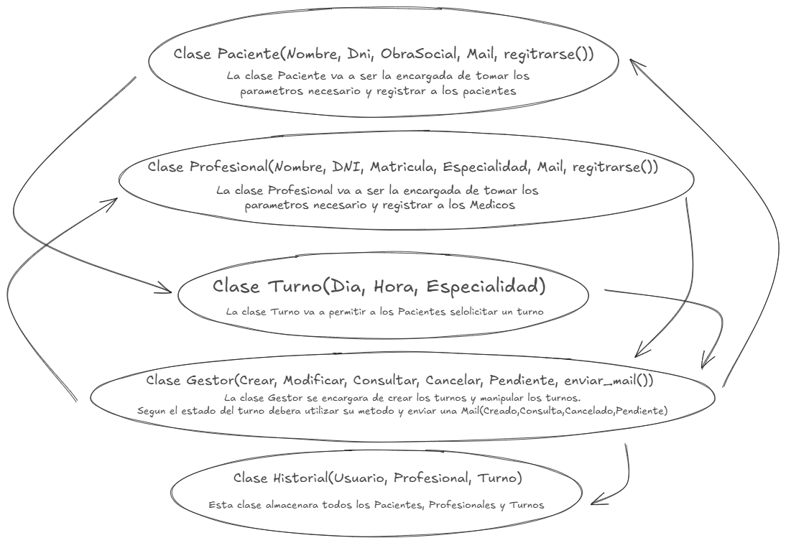

# Introducción a la Programación Orientada a Objetos (POO)  

## ¿Qué es la Programación Orientada a Objetos?  
La **Programación Orientada a Objetos (POO)** es un paradigma de programación basado en la creación y manipulación de "objetos". Un objeto representa una entidad del mundo real con características (**atributos**) y comportamientos (**métodos**).  

Este enfoque facilita la reutilización de código, la organización del software y la escalabilidad de los proyectos.  

---

## Los Cuatro Fundamentos de POO  

### **Encapsulamiento**  
El encapsulamiento permite ocultar los detalles internos de un objeto y exponer solo lo necesario.  

**Ejemplo del mundo real:**  
Un auto 🚗. Como conductor, solo interactúas con el volante y los pedales, pero no necesitas saber cómo funciona el motor internamente.  

---

### **Herencia**  
La herencia permite que una clase reutilice atributos y métodos de otra clase, evitando la repetición de código.  

 **Ejemplo del mundo real:**  
Una **bicicleta eléctrica** 🚴‍♀️ hereda características de una **bicicleta normal**, pero añade nuevas funcionalidades como un motor eléctrico.  

---

### **Polimorfismo**  
El polimorfismo permite que una misma acción se comporte de diferentes maneras según el objeto que la ejecuta.  

 **Ejemplo del mundo real:**  
Un **teléfono inteligente** 📱 puede **reproducir música** 🎵 con una aplicación de Spotify o con YouTube. La acción es la misma ("reproducir música"), pero se ejecuta de diferentes maneras según la aplicación.  

---

### **Abstracción**  
La abstracción permite modelar solo las características esenciales de un objeto, ignorando los detalles innecesarios.  

 **Ejemplo del mundo real:**  
En un **cajero automático** 🏧 solo interactúas con la pantalla y los botones para retirar dinero, pero no ves cómo el sistema procesa tu transacción internamente.  

---

## **Conclusión**  
La Programación Orientada a Objetos permite desarrollar sistemas más organizados, reutilizables y fáciles de mantener. A lo largo del proyecto, aplicaremos estos principios para diseñar un sistema de gestión de turnos médicos.  

---

## **2. Requisitos Iniciales del Sistema**  

A continuación, se presentan cinco requisitos funcionales del sistema de gestión de turnos médicos:  

 **Registro de pacientes y médicos:**  
   - El sistema debe permitir registrar nuevos pacientes y profesionales de la salud.  

 **Asignación de turnos:**  
   - Los turnos deben asignarse según la disponibilidad de cada médico.  

 **Agenda de turnos para médicos:**  
   - Los médicos podrán consultar sus turnos asignados en una vista de calendario.  

 **Notificaciones automáticas:**  
   - Se enviarán notificaciones por email o SMS cuando un turno sea confirmado, cancelado o modificado.  

 **Seguridad y privacidad:**  
   - La información de contacto de pacientes y médicos solo debe ser accesible para personal autorizado.  

---

## **3. Casos de Uso**  

Se describen cinco casos de uso esenciales del sistema:  

### **1. Registrar un nuevo paciente**  
- **Actor(es):** Recepcionista  
- **Descripción:** El recepcionista ingresa los datos de un nuevo paciente en el sistema.  
- **Flujo principal:**  
  1. El recepcionista accede al módulo de pacientes.  
  2. Ingresa nombre, DNI, fecha de nacimiento y contacto.  
  3. Guarda el registro y se muestra una confirmación.  
- **Precondiciones:**  
  - El paciente no debe estar registrado previamente.  
- **Postcondiciones:**  
  - El paciente queda registrado en la base de datos.  

---

### **2. Asignar un turno**  
- **Actor(es):** Recepcionista  
- **Descripción:** Se asigna un turno a un paciente verificando la disponibilidad del médico.  
- **Flujo principal:**  
  1. Se selecciona un paciente y un médico disponible.  
  2. Se elige fecha y hora del turno.  
  3. Se confirma el turno y se notifica al paciente.  
- **Precondiciones:**  
  - El médico debe estar disponible en la fecha y hora elegida.  
- **Postcondiciones:**  
  - El turno se registra en el sistema y se envía una notificación.  

---

### **3. Cancelar un turno**  
- **Actor(es):** Recepcionista, Paciente  
- **Descripción:** Un paciente puede solicitar la cancelación de un turno, o el recepcionista puede cancelarlo en caso de emergencia.  
- **Flujo principal:**  
  1. El paciente accede a la plataforma y elige el turno a cancelar.  
  2. Confirma la cancelación.  
  3. El sistema envía una notificación de cancelación al médico.  
- **Precondiciones:**  
  - El turno debe estar registrado y activo.  
- **Postcondiciones:**  
  - El turno queda cancelado y se libera el espacio en la agenda del médico.  

---

### **4. Consultar turnos asignados**  
- **Actor(es):** Médico  
- **Descripción:** Un médico puede ver la lista de turnos asignados en un calendario.  
- **Flujo principal:**  
  1. El médico inicia sesión en el sistema.  
  2. Accede a su agenda.  
  3. Consulta los turnos asignados por día o semana.  
- **Precondiciones:**  
  - El médico debe estar registrado en el sistema.  
- **Postcondiciones:**  
  - Se muestra la lista de turnos en pantalla.  

---

### **5. Notificación de turno próximo**  
- **Actor(es):** Sistema  
- **Descripción:** El sistema envía una notificación recordando el turno próximo al paciente.  
- **Flujo principal:**  
  1. El sistema verifica la agenda de turnos.  
  2. Si un turno está próximo, envía una notificación por email o SMS.  
  3. El paciente recibe el recordatorio.  
- **Precondiciones:**  
  - El paciente debe tener un turno asignado.  
- **Postcondiciones:**  
  - El paciente recibe la notificación en su dispositivo.

---

### 📌 **Boceto**

 
